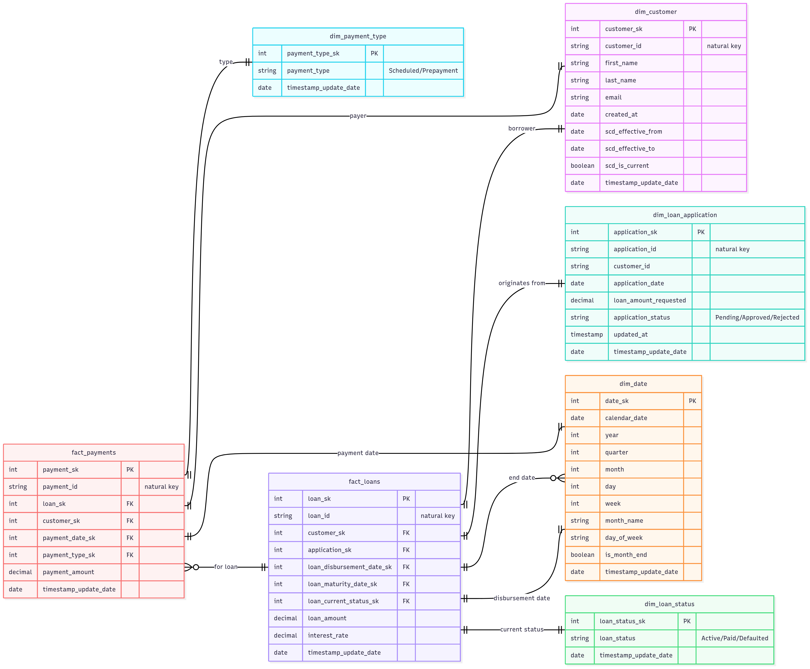

# Requirements: 

Design a data warehouse schema in Snowflake and implement dbt transformations to model the lending concept for analytics and reporting.


# Table of contents
- [Application Schema](#application-schema)
- [Warehouse Schema](#application-schema)
- [Why This Star Schema Answers the Required Analytics](#why-this-star-schema-answers-the-required-analytics)
  - [Loan Performance](#1-loan-performance)
  - [Customer Segmentation](#2-customer-segmentation)
  - [Time Based Analytics](#3-time-based-analytics)
- [Analytic Warehouse Audit/Governance Considerations](#data-governance-considerations-quality--auditability)

## application schema: 


## datawarehouse schema: 



## Why This Star Schema Answers the Required Analytics

In particular, this design can address the following query profiles (with examples):

- Loan performance (e.g., total loans disbursed, repayment rates, default rates)

- Customer segmentation (e.g., by loan amount, repayment behavior)

- Time-based analysis (e.g., loans disbursed by month, payment trends)

### Design considerations
Schema (grain):

fact_loans —> one row per approved/disbursed loan

fact_payments —> one row per payment event

Conformed dimensions: 
dim_date
dim_customer (SCD2)
dim_loan_status
dim_payment_type
dim_loan_application

This Kimball star is built so that measures live in facts and slicing attributes live in dimensions (date, customer, status, type). This separation lets us work with simple, performant star joins and predictable grains.

#### Examples:

### 1. Loan performance


```
-- Total loans disbursed by month
SELECT d.year, d.month, SUM(fl.loan_amount) AS total_disbursed
FROM fact_loans fl
JOIN dim_date d ON fl.loan_disbursement_date_sk = d.date_sk
GROUP BY 1,2
ORDER BY 1,2;

-- Repayment rate by vintage (disbursement month)
WITH p AS (
  SELECT loan_sk, SUM(payment_amount) AS total_paid
  FROM fact_payments GROUP BY 1
)
SELECT d.year, d.month,
       SUM(fl.loan_amount) AS principal,
       SUM(COALESCE(p.total_paid,0)) AS paid,
       SUM(COALESCE(p.total_paid,0)) / NULLIF(SUM(fl.loan_amount),0) AS repayment_rate
FROM fact_loans fl
JOIN dim_date d ON fl.loan_disbursement_date_sk = d.date_sk
LEFT JOIN p ON p.loan_sk = fl.loan_sk
GROUP BY 1,2
ORDER BY 1,2;

-- Default rate by vintage
SELECT d.year, d.month,
       SUM(CASE WHEN ls.loan_status = 'Defaulted' THEN 1 ELSE 0 END) / NULLIF(COUNT(*),0) AS default_rate
FROM fact_loans fl
JOIN dim_date d ON fl.loan_disbursement_date_sk = d.date_sk
JOIN dim_loan_status ls ON fl.loan_current_status_sk = ls.loan_status_sk
GROUP BY 1,2
ORDER BY 1,2;

```


### 2. Customer Segmentation


```
-- Customers by approved amount bucket vs repayment behavior
WITH loan_rep AS (
  SELECT fl.customer_sk, fl.loan_amount, COALESCE(SUM(fp.payment_amount),0) AS total_paid
  FROM fact_loans fl
  LEFT JOIN fact_payments fp ON fp.loan_sk = fl.loan_sk
  GROUP BY 1,2
)
SELECT
  CASE WHEN loan_amount < 5000 THEN 'Under 5k'
       WHEN loan_amount < 10000 THEN '5k–10k'
       WHEN loan_amount < 20000 THEN '10k–20k'
       ELSE '20k+' END AS amount_segment,
  CASE WHEN total_paid >= loan_amount THEN 'Fully repaid'
       WHEN total_paid >= 0.5*loan_amount THEN '50–99% repaid'
       WHEN total_paid > 0 THEN '1–49% repaid'
       ELSE 'No payments' END AS repayment_segment,
  COUNT(DISTINCT customer_sk) AS customers
FROM loan_rep
GROUP BY 1,2
ORDER BY 1,2;

-- Average repayment ratio by customer cohort (first loan month)
WITH first_loan AS (
  SELECT customer_sk, MIN(loan_disbursement_date_sk) AS first_date_sk
  FROM fact_loans GROUP BY 1
),
cust_ratio AS (
  SELECT fl.customer_sk,
         SUM(fp.payment_amount) / NULLIF(SUM(fl.loan_amount),0) AS repay_ratio
  FROM fact_loans fl
  LEFT JOIN fact_payments fp ON fp.loan_sk = fl.loan_sk
  GROUP BY 1
)
SELECT d.year, d.month, AVG(repay_ratio) AS avg_repayment_ratio, COUNT(*) AS customers
FROM first_loan f
JOIN dim_date d ON d.date_sk = f.first_date_sk
JOIN cust_ratio c ON c.customer_sk = f.customer_sk
GROUP BY 1,2
ORDER BY 1,2;

```

### 3. Time based analytics


```
-- Loans disbursed by month with average interest rate
SELECT d.year, d.month,
       COUNT(*) AS loans_count,
       SUM(fl.loan_amount) AS total_disbursed,
       AVG(fl.interest_rate) AS avg_interest_rate
FROM fact_loans fl
JOIN dim_date d ON fl.loan_disbursement_date_sk = d.date_sk
GROUP BY 1,2
ORDER BY 1,2;

-- Payment trends by month and type
SELECT d.year, d.month, pt.payment_type,
       SUM(fp.payment_amount) AS total_payments
FROM fact_payments fp
JOIN dim_date d ON fp.payment_date_sk = d.date_sk
JOIN dim_payment_type pt ON fp.payment_type_sk = pt.payment_type_sk
GROUP BY 1,2,3
ORDER BY 1,2,3;

-- Active loans over time (approximation)
SELECT d.calendar_date, COUNT(*) AS active_loans
FROM dim_date d
JOIN fact_loans fl
  ON d.date_sk BETWEEN fl.loan_disbursement_date_sk
                   AND COALESCE(fl.loan_maturity_date_sk, d.date_sk)
GROUP BY 1
ORDER BY 1;
```

## Data Governance Considerations (Quality & Auditability)

In this design, data quality and transparency are built in from the start. Each table uses clear keys and relationships so that facts always tie back to the right dimensions, and important fields are required (no unexpected nulls). All surrogate keys are declared with primary/unique constraints and dimensions enforce not_null tests on business keys. This makes sure that referential integrity between facts and dimensions. For customers, we track scd changes with effective dates and a “current” flag, so we never lose sight of historical details when someone’s information changes. Facts like loans and payments are treated as immutable events, but we allow for “unknown” placeholder values so late-arriving records don’t break the pipeline. Tests are already incorporated against the dbt models and sources. While lineage metadata is preserved in staging and intermediate models, runtime audit attributes (such as pipeline run IDs, batch identifiers, or dbt invocation IDs) are intentionally not included in the base column design of fact and dimension tables. The decision to embed these fields depends heavily on the ingestion architecture and governance requirements of the organization. For example, a pipeline run ID may be meaningful in a tightly controlled ETL platform, but less useful if the ingestion engine changes frequently or if multiple tools are orchestrating data movement. These runtime attributes are better maintained as part of operational logs or orchestration metadata rather than embedded directly into the analytic schema. Overall, simplicity and narrow fact tables are better but audit columns depends on the scenario/current environment.