# Requirements: 

Design a data warehouse schema in Snowflake and implement dbt transformations to model the lending concept for analytics and reporting.


# Table of contents
- [Application Schema](#application-schema)
- [Warehouse Schema](#application-schema)
- [Why This Star Schema Answers the Required Analytics](#why-this-star-schema-answers-the-required-analytics)
  - [Loan Performance](#1-loan-performance)
  - [Customer Segmentation](#2-customer-segmentation)
  - [Time Based Analytics](#3-time-based-analytics)
- [Analytic Warehouse Audit/Governance Considerations](#data-governance-considerations-quality--auditability)
- [DBT Project Setup](#dbt-project-setup)
  - [Project YAML](#dbt_projectyml)
- [dim_customer.sql model](#dim_customersql-model)
- [fact_payments.sql model](#fact_paymentssql-model)
- [Model tests](#testing-on-ninja_lendingyml)
- [Singular test](#singular-test-on-payments-non_negative_paymentssql)
- [Why Project Structure is Scalable](#why-the-project-structure-is-scalable)
- [Data Pipeline Considerations](#data-pipeline-considerations)


## application schema: 


## datawarehouse schema: 



**<h1> [top](#table-of-contents) </h1>**

## Why This Star Schema Answers the Required Analytics

In particular, this design can address the following query profiles (with examples):

- Loan performance (e.g., total loans disbursed, repayment rates, default rates)

- Customer segmentation (e.g., by loan amount, repayment behavior)

- Time-based analysis (e.g., loans disbursed by month, payment trends)

**<h1> [top](#table-of-contents) </h1>**

### Design considerations
Schema (grain):

fact_loans —> one row per approved/disbursed loan

fact_payments —> one row per payment event

Conformed dimensions: 
dim_date
dim_customer (SCD2)
dim_loan_status
dim_payment_type
dim_loan_application

This Kimball star is built so that measures live in facts and slicing attributes live in dimensions (date, customer, status, type). This separation lets us work with simple, performant star joins and predictable grains.


**<h1> [top](#table-of-contents) </h1>**

#### Examples:

### 1. Loan performance


```sql
-- Total loans disbursed by month
SELECT d.year, d.month, SUM(fl.loan_amount) AS total_disbursed
FROM fact_loans fl
JOIN dim_date d ON fl.loan_disbursement_date_sk = d.date_sk
GROUP BY 1,2
ORDER BY 1,2;

-- Repayment rate by vintage (disbursement month)
WITH p AS (
  SELECT loan_sk, SUM(payment_amount) AS total_paid
  FROM fact_payments GROUP BY 1
)
SELECT d.year, d.month,
       SUM(fl.loan_amount) AS principal,
       SUM(COALESCE(p.total_paid,0)) AS paid,
       SUM(COALESCE(p.total_paid,0)) / NULLIF(SUM(fl.loan_amount),0) AS repayment_rate
FROM fact_loans fl
JOIN dim_date d ON fl.loan_disbursement_date_sk = d.date_sk
LEFT JOIN p ON p.loan_sk = fl.loan_sk
GROUP BY 1,2
ORDER BY 1,2;

-- Default rate by vintage
SELECT d.year, d.month,
       SUM(CASE WHEN ls.loan_status = 'Defaulted' THEN 1 ELSE 0 END) / NULLIF(COUNT(*),0) AS default_rate
FROM fact_loans fl
JOIN dim_date d ON fl.loan_disbursement_date_sk = d.date_sk
JOIN dim_loan_status ls ON fl.loan_current_status_sk = ls.loan_status_sk
GROUP BY 1,2
ORDER BY 1,2;

```


**<h1> [top](#table-of-contents) </h1>**


### 2. Customer Segmentation


```sql
-- Customers by approved amount bucket vs repayment behavior
WITH loan_rep AS (
  SELECT fl.customer_sk, fl.loan_amount, COALESCE(SUM(fp.payment_amount),0) AS total_paid
  FROM fact_loans fl
  LEFT JOIN fact_payments fp ON fp.loan_sk = fl.loan_sk
  GROUP BY 1,2
)
SELECT
  CASE WHEN loan_amount < 5000 THEN 'Under 5k'
       WHEN loan_amount < 10000 THEN '5k–10k'
       WHEN loan_amount < 20000 THEN '10k–20k'
       ELSE '20k+' END AS amount_segment,
  CASE WHEN total_paid >= loan_amount THEN 'Fully repaid'
       WHEN total_paid >= 0.5*loan_amount THEN '50–99% repaid'
       WHEN total_paid > 0 THEN '1–49% repaid'
       ELSE 'No payments' END AS repayment_segment,
  COUNT(DISTINCT customer_sk) AS customers
FROM loan_rep
GROUP BY 1,2
ORDER BY 1,2;

-- Average repayment ratio by customer cohort (first loan month)
WITH first_loan AS (
  SELECT customer_sk, MIN(loan_disbursement_date_sk) AS first_date_sk
  FROM fact_loans GROUP BY 1
),
cust_ratio AS (
  SELECT fl.customer_sk,
         SUM(fp.payment_amount) / NULLIF(SUM(fl.loan_amount),0) AS repay_ratio
  FROM fact_loans fl
  LEFT JOIN fact_payments fp ON fp.loan_sk = fl.loan_sk
  GROUP BY 1
)
SELECT d.year, d.month, AVG(repay_ratio) AS avg_repayment_ratio, COUNT(*) AS customers
FROM first_loan f
JOIN dim_date d ON d.date_sk = f.first_date_sk
JOIN cust_ratio c ON c.customer_sk = f.customer_sk
GROUP BY 1,2
ORDER BY 1,2;

```


**<h1> [top](#table-of-contents) </h1>**


### 3. Time based analytics


```sql
-- Loans disbursed by month with average interest rate
SELECT d.year, d.month,
       COUNT(*) AS loans_count,
       SUM(fl.loan_amount) AS total_disbursed,
       AVG(fl.interest_rate) AS avg_interest_rate
FROM fact_loans fl
JOIN dim_date d ON fl.loan_disbursement_date_sk = d.date_sk
GROUP BY 1,2
ORDER BY 1,2;

-- Payment trends by month and type
SELECT d.year, d.month, pt.payment_type,
       SUM(fp.payment_amount) AS total_payments
FROM fact_payments fp
JOIN dim_date d ON fp.payment_date_sk = d.date_sk
JOIN dim_payment_type pt ON fp.payment_type_sk = pt.payment_type_sk
GROUP BY 1,2,3
ORDER BY 1,2,3;

-- Active loans over time (approximation)
SELECT d.calendar_date, COUNT(*) AS active_loans
FROM dim_date d
JOIN fact_loans fl
  ON d.date_sk BETWEEN fl.loan_disbursement_date_sk
                   AND COALESCE(fl.loan_maturity_date_sk, d.date_sk)
GROUP BY 1
ORDER BY 1;
```


**<h1> [top](#table-of-contents) </h1>**


## Data Governance Considerations (Quality & Auditability)

In this design, data quality and transparency are built in from the start. Each table uses clear keys and relationships so that facts always tie back to the right dimensions, and important fields are required (no unexpected nulls). All surrogate keys are declared with primary/unique constraints and dimensions enforce not_null tests on business keys. This makes sure that referential integrity between facts and dimensions. For customers, we track scd changes with effective dates and a “current” flag, so we never lose sight of historical details when someone’s information changes. Facts like loans and payments are treated as immutable events, but we allow for “unknown” placeholder values so late-arriving records don’t break the pipeline. Tests are already incorporated against the dbt models and sources. While lineage metadata is preserved in staging and intermediate models, runtime audit attributes (such as pipeline run IDs, batch identifiers, or dbt invocation IDs) are intentionally not included in the base column design of fact and dimension tables. The decision to embed these fields depends heavily on the ingestion architecture and governance requirements of the organization. For example, a pipeline run ID may be meaningful in a tightly controlled ETL platform, but less useful if the ingestion engine changes frequently or if multiple tools are orchestrating data movement. These runtime attributes are better maintained as part of operational logs or orchestration metadata rather than embedded directly into the analytic schema. Overall, simplicity and narrow fact tables are better but audit columns depends on the scenario/current environment.


**<h1> [top](#table-of-contents) </h1>**


## DBT project Setup
```text

├─ README.md
├─ dbt_project.yml
├─ packages.yml
├─ macros/                 # (optional; can stay empty)
│  └─ sk.sql               # tiny surrogate-key wrapper (optional)
├─ models/
│  ├─ sources/
│  │  └─ src_ninja_lending.yml
│  ├─ staging/
│  │  ├─ stg_customers.sql
│  │  ├─ stg_loan_applications.sql
│  │  ├─ stg_loans.sql
│  │  ├─ stg_payments.sql
│  │  └─ staging.yml
│  ├─ marts/
│  │  └─ ninja_lending/
│  │     ├─ dim_customer.sql
│  │     ├─ dim_date.sql
│  │     ├─ dim_loan_status.sql
│  │     ├─ dim_payment_type.sql
│  │     ├─ dim_loan_application.sql
│  │     ├─ fct_loans.sql
│  │     ├─ fct_payments.sql
│  │     └─ ninja_lending.yml
│  └─ exposures.yml
├─ snapshots/
│  └─ snap_customers.sql
├─ seeds/
│  ├─ payment_type_seed.csv
│  └─ seeds.yml
└─ tests/
   └─ singular/
      └─ test_payments_positive_amounts.sql
      └─ fct_check_date_ranges.sql

                 
```


**<h1> [top](#table-of-contents) </h1>**

### dbt_project.yml

```yaml
name: ninja_wh
version: 1.0
config-version: 2
profile: lending

models:
  lending_warehouse:
    +materialized: view
    staging:
      +materialized: view
    marts:
      +materialized: incremental
      lending:
        dim_*:
          +materialized: table
        fct_*:
          +materialized: incremental
          +incremental_strategy: insert_overwrite
          +on_schema_change: append_new_columns
```

**<h1> [top](#table-of-contents) </h1>**


### dim_customer.sql model
```sql


--{{ config(materialized='table') }} note that this can be broadly defined across all /marts models

select
  {{ dbt_utils.generate_surrogate_key(['customer_bk','valid_from']) }} as customer_sk,
  customer_bk,
  first_name,
  last_name,
  email,
  valid_from as effective_from, --scd columns
  valid_to   as effective_to, -- scd colums
  case when valid_to is null then true else false end as is_current
from {{ ref('snap_customers') }}


-- 
-- {{
--   config(
--     target_schema='SNAPSHOTS',
--     unique_key='customer_bk',
--     strategy='timestamp',
--     updated_at='created_ts' -- from stg_customers
--   )
-- }}
-- select * from {{ ref('stg_customers') }}
-- 
```
**<h1> [top](#table-of-contents) </h1>**


### fact_payments.sql model

```sql

{{ config(
  materialized='incremental',
  incremental_strategy='merge',
  unique_key='payment_bk',
  on_schema_change='append_new_columns'
) }}

with base as (
  select
    payment_id                             as payment_bk, 
    loan_id                                as loan_bk,
    customer_id                            as customer_bk,
    try_to_date(payment_date)              as payment_date,
    payment_amount,
    upper(payment_type)                    as payment_type_bk
  from {{ ref('stg_payments') }}

  -- TYhis approach ensures a 7 day upsert window on payment_bk
  
    where payment_date >= dateadd(day, -7, current_date)
  
)

, keyed as (
  select
    {{ dbt_utils.generate_surrogate_key(['payment_bk']) }} as payment_sk,
    b.payment_bk,
    b.loan_bk,
    b.customer_bk,
    b.payment_date,
    b.payment_amount,
    b.payment_type_bk
  from base b
)

select
  k.payment_sk,
  k.payment_bk,
  l.loan_sk,                              
  c.customer_sk,                          -- get SCD current row
  d.date_sk           as payment_date_sk,
  t.payment_type_sk,
  k.payment_amount

from keyed k
left join {{ ref('fct_loans') }} l
  on l.loan_bk = k.loan_bk
left join {{ ref('dim_customer') }} c
  on c.customer_bk = k.customer_bk
 and c.is_current                          -- pay events link to current customer
left join {{ ref('dim_date') }} d
  on d.calendar_date = k.payment_date
left join {{ ref('dim_payment_type') }} t
  on t.payment_type_bk = k.payment_type_bk

```
**<h1> [top](#table-of-contents) </h1>**
### Testing on ninja_lending.yml 

```yaml

version: 2

models:
  - name: dim_customer
    description: "Ninja Warehouse: customer dimension."
    columns:
      - name: customer_sk
        tests: [not_null, unique]
      - name: customer_bk
        tests: [not_null, unique]
      - name: email
        tests: [not_null]
      - name: is_current
        tests:
          - accepted_values:
              values: [true, false]

  - name: fct_payments
    description: "Ninja Warehouse: one row per payment event."
    columns:
      - name: payment_sk
        tests: [not_null, unique]
      - name: payment_bk
        tests: [not_null, unique]
      - name: loan_sk
        tests:
          - relationships:
              to: ref('fct_loans')
              field: loan_sk
      - name: customer_sk
        tests:
          - relationships:
              to: ref('dim_customer')
              field: customer_sk
      - name: payment_date_sk
        tests:
          - relationships:
              to: ref('dim_date')
              field: date_sk
      - name: payment_amount
        tests:
          - not_null
```

**<h1> [top](#table-of-contents) </h1>**
### Singular test on payments. non_negative_payments.sql 

```sql

-- fails build or test when we see negative payment amounts
select 1
from {{ ref('fct_payments') }}
where payment_amount <= 0
limit 1
```
**<h1> [top](#table-of-contents) </h1>**
### Why the project structure is scalable
- SCD updates in dim_customer is handled without macros and uses snapshots. This is an option that can give clear history and can be fairly straightforward to test
- Due to dimensional modeling and tests, we retain referential integrity between dimensions and facts. fact tables, like fact_payments avoids attribute drift in this approach and keeps the fact table narrow
- We make use of templating to reference models and handle lineage through refering stage tables and source tables. staging tables are referenced from defined source tables. This allows us to parameterize database connections, schemas without having to touch all assets in the project.
- by modularizing our reference with use of macros, and use of templates, we it is easy to do lift and shift changes across different environments and deployments 

**<h1> [top](#table-of-contents) </h1>**
### Data Pipeline considerations

From my own personal professional experience, data can be consistently moved from source application and into snowflake three different ways

#### Scheduled batch

- This involves scripting a connector to a source production copy (usually a snapshot production copy) and landing them into Snowflake using an orchestrator. This can be a simple cron over a linux/windows box, using tools like Informatica or leveraging integrated tooling available in your environment such as Azure Data Factory, AWS lambda etc.

- This needs to be built individually across all sources where access might need to be tweaked in each case. For example, some sources lie on a different VPC or requires firewall whitelisting and you'll have to be maintain that handshake.

#### Log mining 

- One approach i have explored and worked with is sourced log based CDC. A model that works is writing CDC changes into parquet files and ingesting them in snowflake through tasks or file watches. When moving data from an application into Snowflake using log-based CDC through AWS DMS, I’ve seen the value and also the  friction it creates between data engineering team and DBAs. On the organizational side, the first challenge is usually convincing DBAs and infrastructure teams to enable database logging. They worry about performance overhead, so I’ve had to run proof-of-concepts on read replicas, showing before-and-after metrics to gain buy-in. 

- Ownership of the pipeline is another issue. When a CDC task stalls or when schema changes are deployed, is it the responsibility of the application team, the DBA team, or the data engineering group to remediate? Typically, for large organization , the ownership is unclear and tiered. Security and compliance stakeholders also raise concerns about PII landing in S3. So often a point of contention is documenting security protocols like encryption, strict IAM roles and key management. 

- For the business expectation: people hear “near real time” and assume milliseconds of freshness, while in reality you need to set pragmatic SLAs like under 15 minutes for payments and under two hours for master data. Cutovers from full load to CDC are organizationally sensitive—if not carefully communicated. These windows need to be understood since they could they produce duplicates or gaps and planning around deployment windows and reconciliation reports are important for auditing.

- From a technical standpoint, CDC based capture through tools like AWS DMS is reliable but it comes with a few niche headaches. Long-running transactions in the source database can stall CDC for hours since changes must be applied in commit order. A remedy here is to break bulk operations into smaller batches instead if possible. 

#### Source batch replication and file watches

- Another approach I’m currently using instead of log-based CDC is batched replication with S3 and auto ingestion with toos like Snowpipe. This is where the source application produces periodic extracts (full or incremental) that land as files in S3. These exports originate from the source application/replication jobs in AWS. Snowpipe can be configured with event notifications from S3 so that as soon as a file lands, it is automatically ingested into Snowflake raw staging tables. This pattern is attractive because tt also works well for our application systems where we have schemas that evolve frequentlyt or where soft deletes are modeled as flags instead of true deletes.

- There are nuances however. I have to normalize time zones from the source (usually casted as variant types on schemas that are custom/non rigid) to enforce UTC consistently during extraction and ingestion. Numeric precision has to be be carefully managed. For example, Oracle’s NUMBER data type is unbounded (up to 38 digits by default) and if left untyped in replication it generically defaults to Snowflake’s FLOAT. This causes downstream precision errors and can become problematic. 

- The approach ultimately lies on the current environment, team resources, delivery thresholds on downstream consumers and how rigid the source system is. 

